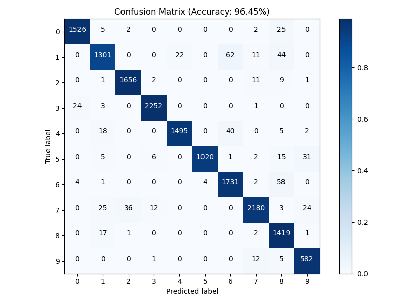
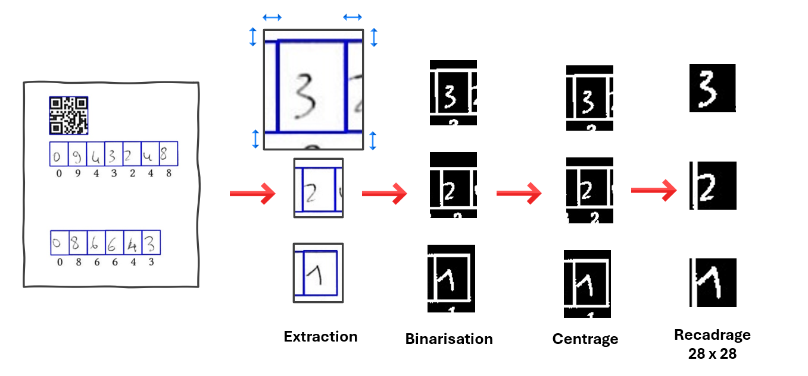
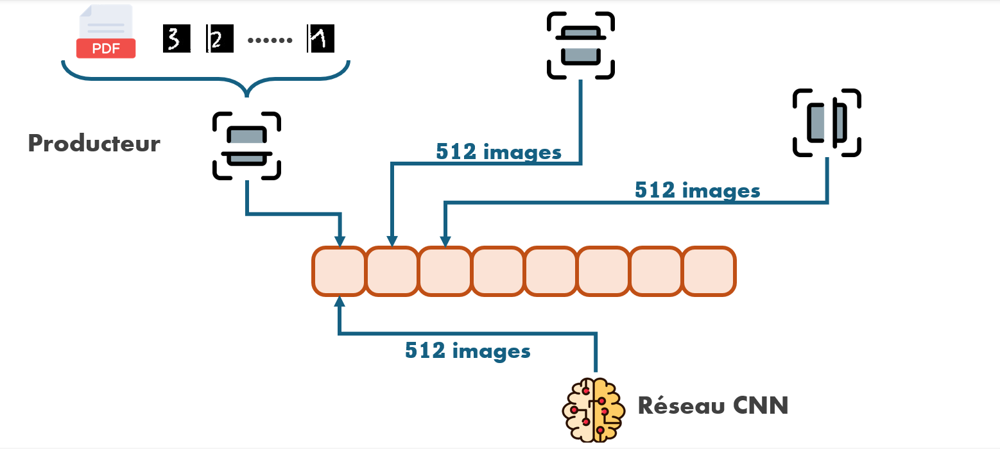

# 🚀 Extraction Automatique de Chiffres Manuscrits 

Ce projet implémente un pipeline industriel dédié à l'**extraction et l'identification automatique de chiffres manuscrits** dans des formulaires scannés. Il permet d'automatiser des tâches administratives comme la lecture de numéros d'étudiants ou de formulaires CERFA avec une **précision (Accuracy) de 96%**.

---

## 📊 Performances & Précision

### **Résultats du Modèle**
> **Statistiques :** Inférence réalisée sur un jeu de test de **11 900 chiffres extraits**.
> **Score :** `Accuracy: 96.45%`

#### **Matrice de Confusion**
 

### **Benchmarks d'Optimisation**
| Métrique | Valeur Optimisée |
| :--- | :--- |
| **Logiciel** | ONNX Runtime + Multiprocessing (3P/1C) |
| **Vitesse d'exécution** | **1s / 2200 images** |
| **Usage RAM (Peak)** | 389 Mo |
| **Utilisation CPU** | 95.7% |

## ⚙️ Pipeline de Prétraitement (Computer Vision)

Le succès de l'identification repose sur un pipeline de prétraitement rigoureux en trois étapes clés :

### **1. Recalage par Homographie**
À partir d’un fichier **JSON** de configuration et de l'image brute, le système détecte les **QR codes** servant de points d'ancrage. En appliquant une **transformation de perspective (homographie)**, nous retrouvons la position réelle et précise de chaque case, même si le document est incliné ou déformé lors du scan.

### **2. Extraction avec Marge de Sécurité**
Chaque caractère est extrait en ajoutant une **marge de sécurité** (padding). Cette étape est cruciale : si un chiffre dépasse légèrement de sa case, la marge permet de ne perdre aucune information. Lors du futur centrage, le système pourra isoler le chiffre en se basant sur la densité de pixels la plus élevée.

### **3. Normalisation au format MNIST**
Pour garantir une compatibilité maximale avec le moteur d'inférence, chaque case subit les traitements suivants :
* **Binarisation :** Nettoyage du bruit et passage en noir et blanc pur.
* **Centrage par Centre de Masse :** Le chiffre est repositionné au centre de l'image pour éviter les décalages.
* **Recadrage 28×28 :** Redimensionnement final au format standard du dataset **MNIST**, permettant une reconnaissance optimale par l'IA.
 

## 🏗️ Architecture du Système (Multi-Processus)
Pour maximiser le débit de traitement et contourner les limitations du GIL (Global Interpreter Lock) de Python, le système repose sur une architecture Multi-Producteurs / Mono-Consommateur hautement parallélisée.

1. Flux de données et Parallélisation
3 Producteurs (CPU-Bound) : Chargés du prétraitement lourd (lecture PDF, homographie par QR Code et segmentation). Ils préparent les images par lots (batches) de 512.

File d'attente (Queue) : Une file d'attente limitée à 8 slots sert de tampon. Elle synchronise les processus et empêche l'accumulation de données brutes en mémoire.

1 Consommateur (Inférence) : Récupère les lots de 512 images et utilise ONNX Runtime pour une classification ultra-rapide des chiffres manuscrits.

2. Optimisation des Ressources
Cette architecture permet de saturer le CPU (parallélisme réel) tout en limitant strictement l'usage de la RAM grâce au streaming par lots.

 

## 📂 Structure du Projet

data/ : Contient les fichiers JSON de configuration (positions théoriques des cases et QR Codes pour le calcul de l'homographie).

engine/ : Scripts dédiés à l'entraînement sur données augmentées et au fine-tuning du modèle.

preprocess/ : Algorithmes de vision par ordinateur pour le recalage de l'image (correction d'inclinaison) et l'extraction des cases.

identification/ : Moteur d'inférence ONNX pour la reconnaissance des chiffres.

input/ : Dossier source où déposer les documents PDF/Images à traiter.

output/ : Dossier de sortie pour la visualisation des résultats et des diagnostics.

## 🚀 Installation & Usage

Cloner le projet

```Bash
git clone https://github.com/Abdelbasset-hds/Hekzam-FormDetection.git
cd Hekzam-FormDetection
```

Préparer l'environnement

```Bash
python -m venv HekzamEnv
source HekzamEnv/bin/activate  
pip install -r requirement.txt
```

Lancer le traitement

```Bash
python main.py
```